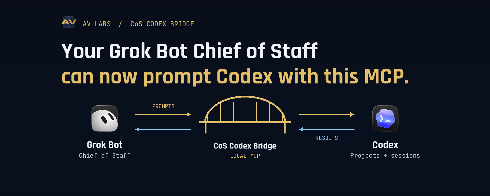
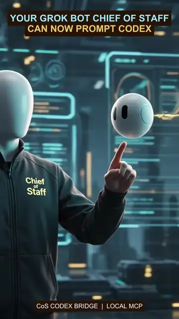

# CoS Codex Bridge

**Your Chief of Staff. Now in charge of Codex, too.**



[](https://github.com/AV-Labs-Co/cos-codex-bridge/actions/workflows/ci.yml)
[](https://github.com/AV-Labs-Co/cos-codex-bridge/releases)
[](LICENSE)
[](https://nodejs.org/)
[](https://glama.ai/mcp/servers/AV-Labs-Co/cos-codex-bridge)

A local MCP server that lets a Chief of Staff client find Codex tasks, create project work, deliver whole prompts, follow progress and continue the same conversation. Free MIT core. No bridge subscription or checkout. Your existing Codex access is required for real execution.

**v0.1.0 preview.** Normal local MCP: install, connect your client, then use the `bridge_*` tools. No daemon or Desktop-owner adapter installation is required. Core workflow has passed owner field testing on macOS. Desktop-owned paused-queue recovery is a known v0.1 limitation, deferred from this release. Sidebar rendering on newer Codex Desktop versions is not certified; check the compatibility table before relying on it. A queued receipt is never proof that work started.

## What your Chief of Staff can do

- Turn research or a product idea into a new Codex project and task.
- Send the complete prompt and attached text without manual copying and pasting.
- Find an existing Codex task, read its progress and continue the same conversation.
- Track delivery with durable receipts instead of assuming an accepted prompt ran.
- Rename, assign, pin and cancel scoped work across approved projects.
- Keep local project access inside explicit allowlisted directories.

Example: “Create a project for this idea, send my research to Codex, monitor the build, and follow up in the same task with the review findings.”

### See the handoff

<p align="center">
  
</p>

The animation illustrates the local handoff. It uses no private Desktop data or
project screenshots.

## Try the safe demo

This exercises the MCP workflow locally without a Codex account, model call or project changes:

```sh
git clone https://github.com/AV-Labs-Co/cos-codex-bridge.git
cd cos-codex-bridge
npm ci
npm run demo
```

The demo prints a completed receipt, payload hash and task metadata so you can see the bridge contract before granting access to a real project.

## Easiest setup: give this link to your local assistant

[Open the repository and installation instructions](https://github.com/AV-Labs-Co/cos-codex-bridge#install). An assistant with local terminal access can install it for you. A browser-only or cloud-only chat cannot install software on your computer.

Copy this installation request to your Chief of Staff:

> Install CoS Codex Bridge from https://github.com/AV-Labs-Co/cos-codex-bridge. Read the README and SECURITY.md first. Use only a project folder I approve, keep read-only defaults, and preserve existing client configuration. Follow the installer instructions, run doctor, and connect the generated stdio MCP entry to my local client. Tell me what passed and what still needs setup. Wait for my first task before submitting any work. Do not publish or deploy anything.

You can also download the source archive from [Releases](https://github.com/AV-Labs-Co/cos-codex-bridge/releases), extract it and follow the steps below. Git cloning makes later updates easier. No npm package or hosted endpoint is required.

## Install

Requires Node.js 22+, npm, Codex CLI authenticated locally, and a local client supporting stdio MCP. Desktop registration additionally requires Codex Desktop on macOS. 

```sh
git clone https://github.com/AV-Labs-Co/cos-codex-bridge.git
cd cos-codex-bridge
npm ci
npm test
node scripts/install.mjs --root /absolute/path/to/your/projects
```

The installer writes a private config, launcher and MCP snippet under `~/.local/share/cos-codex-bridge`. Keep the checkout in place. Default execution is read-only; use `--write` only for approved project edits. Choose specific project roots, never your entire home directory. Add `--codex /absolute/path/to/codex` if Codex is not on PATH. See [installer and upgrade steps](INSTALLER.md).

```sh
~/.local/share/cos-codex-bridge/cos-codex-bridge doctor
```

Check `codexAvailable`, `mode`, `sandbox` and `roots`. Doctor reports capabilities and installation health, not authentication success or visual verification. For a model-free demo, install into a separate prefix with `--demo`.

Paste the generated `mcp-client.json` into your client's MCP configuration. Equivalent shape:

```json
{"mcpServers":{"cos-codex-bridge":{"command":"/absolute/path/to/node","args":["/absolute/path/to/cos-codex-bridge/dist/cli.js","--config","/absolute/path/to/config.json","mcp"]}}}
```

## A complete handoff

Tell your Chief of Staff: “Find my app project, send this entire implementation brief to Codex, monitor it, then continue that same task with the review findings.”

1. Resolve the exact project and task with `bridge_projects` and `bridge_sessions`.
2. Create a directory if needed, then **register** it. A directory alone is not a Desktop project.
3. Call `bridge_submit` with `project`, the whole `prompt`, and a stable `requestId`. Include `threadId` for follow-ups.
4. Poll `bridge_receipt`. Verify hashes, task ID and eventual completion. Handle clarification with `bridge_answer`.
5. Use `bridge_session_manage` to rename, assign or pin the task. Stored metadata and visible Desktop rendering are separate proofs.

A successful model completion does not independently prove that generated code works. Review and test the result.

## Ten tools, twelve features and one known limitation

| Tool | Purpose |
|---|---|
| `bridge_projects` | List aliases, create a folder, register/open or inspect a Desktop project |
| `bridge_sessions` | Find and read existing allowed tasks, including externally created tasks |
| `bridge_submit` | Start or follow up; stable request IDs and complete UTF-8 payloads |
| `bridge_receipt` | Durable progress, hashes, bounded output and explicit uncertainty |
| `bridge_steer` | Retry recovery of an existing bridge queue item, without resending it |
| `bridge_answer` | Answer pending clarification; never approve permission expansion |
| `bridge_cancel` | Request cancellation of bridge-owned direct work |
| `bridge_artifact` | Read/write versioned text artifacts without overwrite |
| `bridge_session_manage` | Rename, pin/unpin and assign to a registered project |
| `bridge_doctor` | Report mode, Codex version, scope and honest capability limits |


Known limitation (uncommon):
If a session already has an active writer and a steering prompt is sent, the prompt waits for a natural pause/stopping point. On a long autonomous run, the only human intervention needed is pressing Steer in that case.

See the [v1 capability contract](docs/FEATURES.md) and [verification matrix](docs/VERIFICATION.md).

## Busy tasks, steering and interruption recovery

Direct submission defaults to `SESSION_BUSY` when another writer owns the task. To opt into the existing Desktop execution policy, use `onBusy:"queue"` and `acceptDesktopPolicy:true`. `delivery:"desktop-queue"` explicitly queues to an existing task. These paths use Codex's first-party queue API, the equivalent of `codex queue`, and preserve separate text inputs and stable client message IDs.

Receipts distinguish `busy`, `queued`, `steered`, `delivered`, `completed`, `blocked` and `uncertain`. `thread/queue/start` recovery has passed a local live test with the writer available. **Desktop-owned paused recovery is deferred for v0.1; it may require a human Steer click.** `bridge_steer` retries the exact saved item when the writer is available, including an existing CLI-created item adopted by its queue ID. `bridge_sessions` with `includeQueue:true` exposes pending IDs and inferred needs-steer state. It never silently forks or treats queue disappearance as delivery. See [queue semantics](docs/QUEUE.md).

## Security defaults

Default-deny realpath allowlists, read-only direct execution, private local receipts, bounded UTF-8 input, explicit project/task matching and no implicit cloud endpoint. Prompts and artifacts are stored locally in plaintext for receipt integrity; do not treat them as encrypted storage.

Direct workers disable inherited connectors and deny permission approvals. Desktop queue is a separate, explicit policy boundary: it uses the existing task's permissions and tools. The bridge cannot enforce a narrower sandbox inside that already-running task. No automatic store submission, social posting or publication is authorized. See [SECURITY.md](SECURITY.md).

## Client matrix

| Environment | Evidence |
|---|---|
| Grok Bot / CoS on owner's Mac | Field-tested local CLI orchestration; installation-specific integration |
| Standard stdio MCP client | Protocol handshake, schemas, errors and demo tested automatically |
| Codex Desktop macOS / CLI 0.153.4 | Owner-tested registration, assignment, pinning, continuity and queue delivery |
| Codex Desktop 0.155.0-alpha.9.2 | Native metadata observed in field; sidebar rendering not certified; legacy adapter disabled |
| Other MCP clients | Expected protocol compatibility; not individually field-certified |
| Windows / Linux Desktop integration | Not verified; no macOS Desktop parity claim |
| Ordinary ChatGPT chats | Not supported |
| Hosted service / Composio cloud | Not provided or listed |

Native project assignment is supported through the installed experimental App Server API. An optional, version-gated legacy Desktop assignment adapter has backup and race checks; it is off by default and remains experimental.

## Community

This project focuses on reliable Chief of Staff handoffs rather than a universal superiority claim. Other Codex MCP projects solve useful adjacent workflows. We do not claim “most advanced,” all-account control or blanket autonomy.

Star it to follow development, fork it for your client, and report reproducible failures with **redacted** version, state and error details. Never post full private prompts or credentials. [MIT License](LICENSE).
